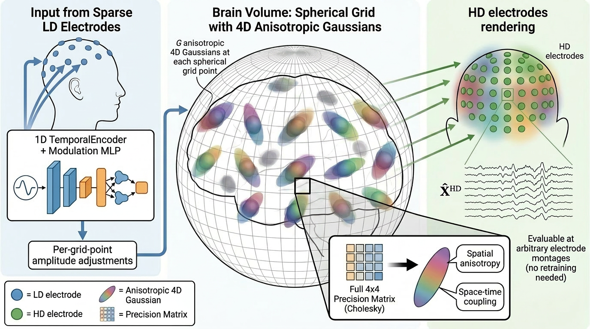
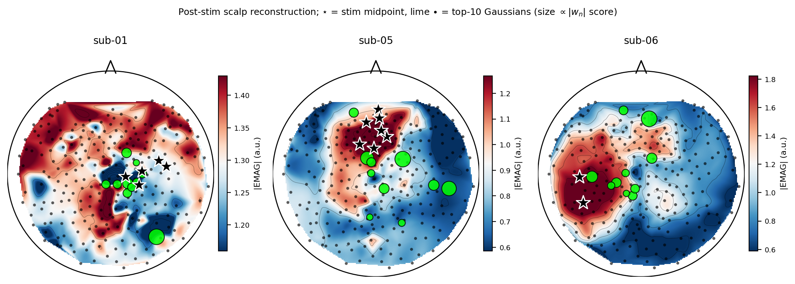
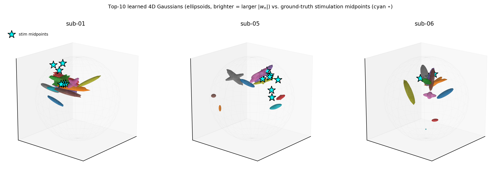

# EMAG — EEG Mixture-of-4D-Gaussians

Camera-ready reference implementation of **EMAG**, a spatio-temporal mixture-of-4D-Gaussians model for EEG super-resolution (low-density → high-density electrode arrays).

<p align="center">
  
</p>

At each brain grid location the source field is represented by `G` 4D Gaussians (3 space + 1 time) with a learnable full 4D precision (Cholesky-parameterized). A fixed or learned forward operator projects the latent field to the electrode space.

## Source validation

EMAG recovers the ground-truth source localization both at the scalp (2D topomaps) and in volumetric source space (3D).

<p align="center">
  
  
</p>

## Interactive viewer

A live, in-browser viewer of the learned 4D Gaussians (scrub through time, switch dataset/subject/SR factor) is published via GitHub Pages — see [`site/`](site/) and the live URL once Pages is enabled.

## Repo layout

```
EMAG/
├── src/
│   ├── models/
│   │   ├── base.py            # BrainGrid, leadfield utilities, base class, Fourier features
│   │   └── model.py           # EMAG model
│   ├── data/
│   │   ├── eeg_constellations.py
│   │   ├── channel_subsets.py
│   │   ├── ld_interpolation.py
│   │   ├── leadfield_io.py
│   │   ├── localize_mi_dataloader.py
│   │   ├── seed_dataloader.py
│   │   └── seed_iv_dataloader.py
│   ├── training/
│   │   └── train.py           # single-subject SR training entry point
│   └── eval/
│       └── visualize_subject.py   # given (subject, time), plot LD + HD + reconstruction
├── configs/environment.yml
├── LICENSE
└── README.md
```

## Install

```bash
conda env create -f configs/environment.yml
conda activate emag
```

Place the datasets under `datasets/` (or pass `--data_root`):

```
datasets/
├── Localize-MI/
├── SEED/
└── SEED-IV/
```

## Train

Single-subject SR run (Localize-MI, SR factor 4):

```bash
PYTHONPATH=src python src/training/train.py \
    --dataset localize_mi --subject sub-01 --sr_factor 4 --epochs 100 \
    --data_root /path/to/Localize-MI/derivatives/epochs \
    --results_dir ./results --checkpoint_dir ./checkpoints
```

SEED / SEED-IV:

```bash
PYTHONPATH=src python src/training/train.py --dataset seed     --subject 1 --sr_factor 4 \
    --data_root /path/to/SEED     --results_dir ./results --checkpoint_dir ./checkpoints
PYTHONPATH=src python src/training/train.py --dataset seed_iv  --subject 1 --sr_factor 4 \
    --data_root /path/to/SEED-IV  --results_dir ./results --checkpoint_dir ./checkpoints
```

Useful flags: `--n_gaussians_per_point`, `--grid_type {cube,sphere}`, `--n_grid`, `--ld_conditioning {none,global,per_grid}`, `--forward_operator {free,leadfield_matrix}`. See `train.py --help` for the full list.

Results are written under `results/<run_name>/` and checkpoints under `checkpoints/<run_name>/`.

## Inference / Visualization

```bash
PYTHONPATH=src python src/eval/visualize_subject.py \
    --checkpoint checkpoints/<run_name>/<subject>/final.pt \
    --dataset localize_mi --subject sub-01 --time_idx 1234 --out viz.png
```

Produces a 3-row figure: LD input channels, HD ground truth, and EMAG reconstruction at the requested timestep.

## Citation

```bibtex
@article{lazarovich2026emag,
  title={EMAG: Differentiable 4D Gaussian Mixture Splatting for EEG Spatial Super-Resolution},
  author={Lazarovich, Alex and Shahar, Ofir Itzhak and Elkin, Gur and Ben-Shahar, Ohad},
  journal={arXiv preprint arXiv:2605.29731},
  year={2026}
}
```

## License

See [LICENSE](LICENSE).
